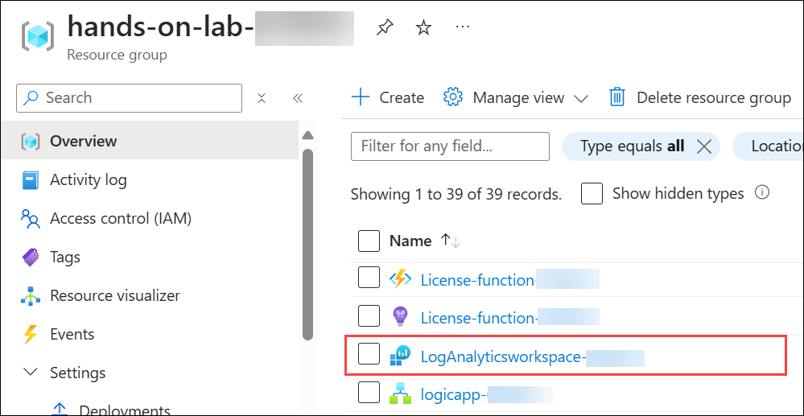
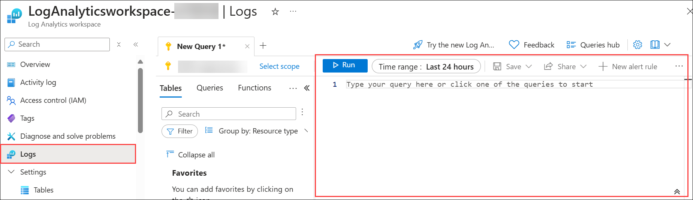
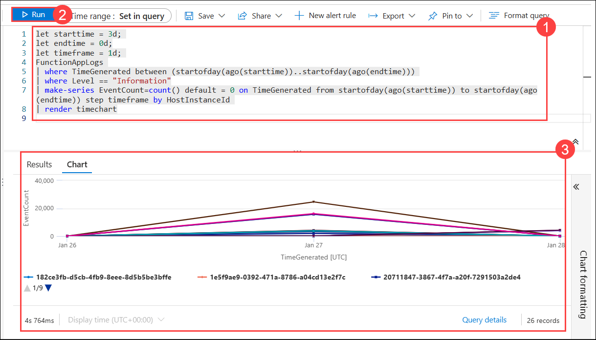
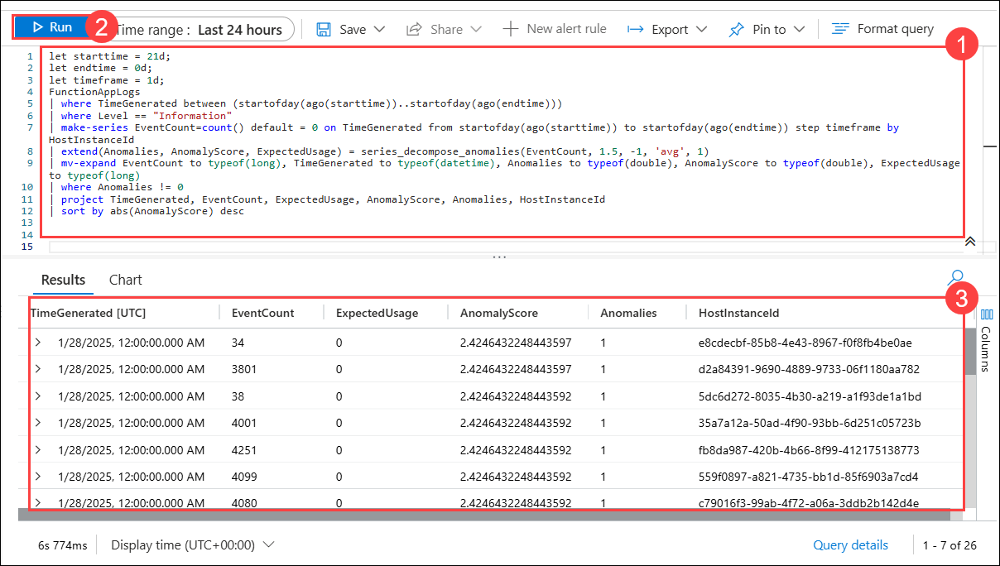
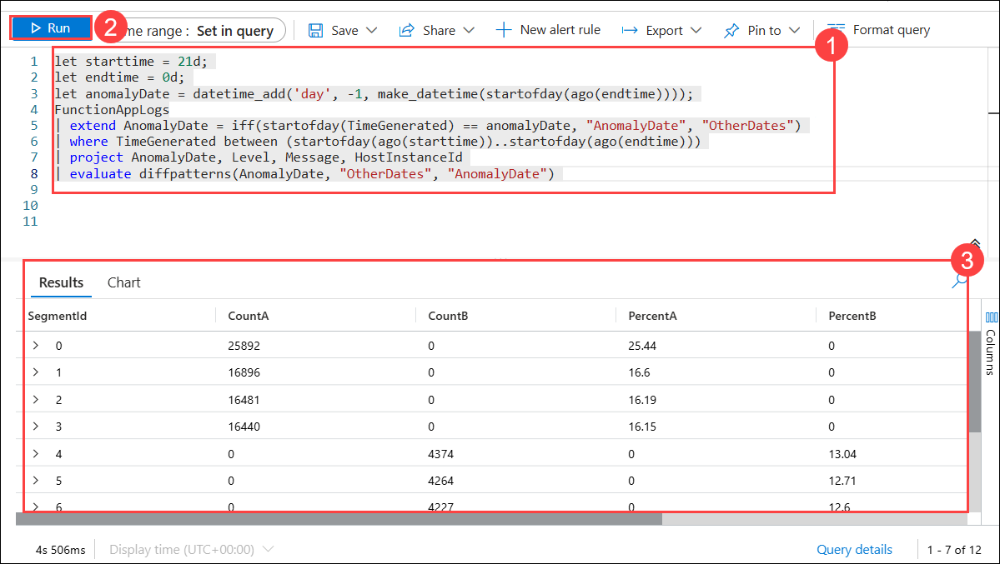

# Exercise 3: Monitor Your Azure Functions with Application Insights, Log Analytics, and AI-driven Insights (1 Hour 30 Minutes) (Log Analytic Workspace, Application Insights) 

### Task 1: Configure a Log Analytics Workspace and connect Application Insights 

Set up Log Analytics workspace and Application Insights to monitor and collect data from Azure Functions. 

1. In the search bar of the Azure Portal, type **Log Analytics workspaces (1)** and select **Log Analytics workspaces (2)** from the search results.

   
1. Click on **+Create.**

   
1. Enter the following details and click on **Review + Create**.
   | Setting | Action |
   | -- | -- |
   | **Subscription** | Keep it as default |
   | **Resource Group** | hands-on-lab-<inject key="DeploymentID"></inject> (2) |
   | **Name** | **LogAnalyticsworkspace-<inject key="DeploymentID" enableCopy="false" />** (3) |
   | **Region** | **<inject key="Region" enableCopy="false" />** (4) |
   
   
1. Click on **Create**.
1. In the search bar of the Azure Portal, type **Application Insights (1)** and select **Application Insights (2)** from the search results.
1. Select the appinsights-<inject key="DeploymentID"></inject>.
1. Click on `Properties` under **Configure**.
1. Click on Migrate to `Workspace-based` under **WORKSPACE**.
1. Enter the following details and click on **Apply**.
   | Setting | Action |
   | -- | -- |
   | **Subscription** | Keep it as default |
   | **Log Analytics Workspace** | **LogAnalyticsworkspace-<inject key="DeploymentID" enableCopy="false" />** |
1. Click on `Diagnostic settings` under Monitoring.
1. Click **+ Add diagnostic setting**.
1. Select the following options and click on **Save**.
   | Setting | Action |
   | -- | -- |
   | **Logs** | allLogs |
   | **Destination details** | **Send to Log Analytics workspace** |
   | **Subscription** | Keep it as default |
   | **Log Analytics Workspace** | **LogAnalyticsworkspace-<inject key="DeploymentID" enableCopy="false" />** |


### Task 2: Write basic KQL queries to explore function logs and metrics 

Learn to write KQL (Kusto Query Language) queries to explore function logs and key metrics. 

1. In the search bar of the Azure Portal, type **Log Analytics workspaces (1)** and select **Log Analytics workspaces (2)** from the search results.
1. Select the LogAnalyticsworkspace-1571992-<inject key="DeploymentID" enableCopy="false" />.
1. Click on **Logs** on the left pane.
1. Copy and paste the following query in the querry box and click on **Run**.
   ```
   FunctionAppLogs
   | order by TimeGenerated desc
   ```

1. Copy and paste the following query in the querry box and click on **Run**.
   ```
   FunctionAppLogs
   | project TimeGenerated, HostInstanceId, Message, _ResourceId
   | order by TimeGenerated desc
   ```

1. Copy and paste the following query in the querry box and click on **Run**.
   ```
   FunctionAppLogs
   | where FunctionName == "<Function name>" 
   | order by TimeGenerated desc
   ```

1. Copy and paste the following query in the querry box and click on **Run**.
   ```
   FunctionAppLogs
   | where ExceptionDetails != ""  
   | order by TimeGenerated asc
   ```

### Task 3: Run advanced KQL queries (e.g., joins, aggregates, time-series analysis) 

Dive deeper into KQL for advanced queries, including joins, aggregation, and time-series analysis. 

1. Copy and paste the following query in the querry box and click on **Run**.
   ```
   requests
   | join kind=inner (dependencies) on appId
   ```

1. Copy and paste the following query in the querry box and click on **Run**.
   ```
   requests
   | project appName, timestamp, operation_Name
   | join kind=inner (dependencies) on operation_Name
   | project timestamp, operation_Name, application_Version
   ```

1. Copy and paste the following query in the querry box and click on **Run**.
   ```
   requests
   | join kind=inner (dependencies) on success
   | summarize count() by bin(timestamp, 1h), operation_Name
   | order by timestamp desc
   ```

1. Copy and paste the following query in the querry box and click on **Run**.
   ```
   requests
   | join kind=inner (dependencies) on success
   | summarize 
      avg(duration) ,   // Average request duration
      sum(duration),    // Total request duration
      min(timestamp),   // First request time in the hour
      max(timestamp),   // Last request time in the hour
      count()           // Total number of successful requests
      by bin(timestamp, 1h), operation_Name
   | order by timestamp desc
   ```

### Task 4: Analyze function metrics (e.g., execution time, failure rate) and adjust granularity 

Examine important function metrics like execution time and failure rate, and adjust data granularity for better insights. 

1. In the search bar of the Azure Portal, type **Application Insights (1)** and select **Application Insights (2)** from the search results.
1. Select the appinsights-<inject key="DeploymentID"></inject>.
1. On the overview page itself you will be able to see the following metrics:
   - Failed requests
   - Server response time
   - Server requests
   - Availability

      

1. Granularity can be changes by the `Show data for last` option, try changing it to 6 hours and 12 hours to reflect the updated data for that particular timeline.

### Task 5: Leverage Log Analytics Workspace (AIOps) and Detect Anomalies with KQL using Machine Learning capabilities 

- **Time Series:** A time series is a sequence of data points collected or recorded at consistent intervals over time. It helps track and analyze trends, patterns, and changes in data, such as system performance or event counts. By visualizing data in a time series, we can spot regular behaviors and detect deviations that may indicate issues or changes in behavior.

- **Anomaly Detection:** Anomaly detection is the process of identifying unusual or unexpected patterns in data that deviate from the norm. These anomalies can signal problems, such as system errors or sudden changes in behavior, that need attention. Early detection of anomalies helps prevent small issues from escalating into larger problems, making it a crucial tool for maintaining system health.

- **Root Cause Detection:** Root cause detection involves investigating and identifying the underlying cause of an anomaly or problem. After detecting something unusual in the data, it's important to trace back to the cause, such as a bug, configuration change, or external factor. Understanding the root cause allows for more effective solutions and prevents future occurrences of the same issue.

>**Note:** The queries provided may return limited data as they are being run in a lab environment with logs from a single day. In a production environment, where data spans over a longer period and encompasses more events, these queries can fully leverage their capabilities, providing more comprehensive insights and analysis.

In this task, you will apply machine learning (AIOps) capabilities within KQL to detect and analyze anomalies in function logs.

1. In the Azure Portal, navigate to your resource group **hands-on-lab-<inject key="DeploymentID"></inject>**.

1. From the resource list, select **LogAnalyticsworkspace-<inject key="DeploymentID"></inject>**.

   

1. In the Log Analytics Workspace page, select **Logs** from the left menu. You will see a Query pane, where you can run queries and get results accordingly.

   

1. First you will be creating a time series data using the data available in log analytics. Paste the following **query (1)** in query pane, click on **Run (2)** and the **results (3)** will be displayed below in the line chart format.

   ```
   let starttime = 3d; 
   let endtime = 0d;
   let timeframe = 1d; 
   FunctionAppLogs 
   | where TimeGenerated between (startofday(ago(starttime))..startofday(ago(endtime))) 
   | where Level == "Information"
   | make-series EventCount=count() default = 0 on TimeGenerated from startofday(ago(starttime)) to startofday(ago(endtime)) step timeframe by HostInstanceId 
   | render timechart
   ```

   

   >**LabTip:** This query is analyzing log data from the last 3 days, focusing on entries where the log level is "Information." It counts the number of "Information" logs for each host instance (server or function) per day. The make-series function creates a time series of daily log counts, and the render timechart command visualizes the data as a time chart. This helps track how many logs were generated by each host on a daily basis.

1. Once time series is done, next, you'll be checking for anomolies in the log data. Remove the existing query and Paste the following **query (1)** in query pane, click on **Run (2)** and the **results (3)** will be displayed below in the line chart format.

   ```
   let starttime = 21d; 
   let endtime = 0d; 
   let timeframe = 1d; 
   FunctionAppLogs 
   | where TimeGenerated between (startofday(ago(starttime))..startofday(ago(endtime))) 
   | where Level == "Information" 
   | make-series EventCount=count() default = 0 on TimeGenerated from startofday(ago(starttime)) to startofday(ago(endtime)) step timeframe by HostInstanceId 
   | extend(Anomalies, AnomalyScore, ExpectedUsage) = series_decompose_anomalies(EventCount, 1.5, -1, 'avg', 1) 
   | mv-expand EventCount to typeof(long), TimeGenerated to typeof(datetime), Anomalies to typeof(double), AnomalyScore to typeof(double), ExpectedUsage to typeof(long) 
   | where Anomalies != 0 
   | project TimeGenerated, EventCount, ExpectedUsage, AnomalyScore, Anomalies, HostInstanceId 
   | sort by abs(AnomalyScore) desc 
   ```

   

   >**LabTip:** This query looks at log data from the past 21 days where the log level is "Information." It counts how many "Information" logs were generated per day for each host instance. Then, it checks for anomalies in the event count using the **series_decompose_anomalies** function, which compares actual counts to expected ones and calculates an anomaly score. The results show only the records where anomalies were found, and they are sorted by the severity of the anomaly score to highlight the most unusual activity.

1. Now, you will be checking for the root cause for these anomolies.Remove the existing query and Paste the following **query (1)** in query pane, click on **Run (2)** and the **results (3)** will be displayed below in the line chart format.

   ```
   let starttime = 21d; 
   let endtime = 0d; 
   let anomalyDate = datetime_add('day', -1, make_datetime(startofday(ago(endtime)))); 
   FunctionAppLogs
   | extend AnomalyDate = iff(startofday(TimeGenerated) == anomalyDate, "AnomalyDate", "OtherDates") 
   | where TimeGenerated between (startofday(ago(starttime))..startofday(ago(endtime))) 
   | project AnomalyDate, Level, Message, HostInstanceId 
   | evaluate diffpatterns(AnomalyDate, "OtherDates", "AnomalyDate")
   ```

   

   >**LabTip:** This query analyzes logs from the past 21 days and identifies patterns that differ on a specific anomaly date (yesterday) compared to other days. It labels logs as either "AnomalyDate" or "OtherDates" and then uses the diffpatterns function to highlight differences in log patterns between the anomaly date and normal days. This helps in identifying unusual system behavior that may have caused an issue.

### Task 6: Explore insights from function execution failures and optimize for faster troubleshooting  

Investigate insights from execution failures and optimize for faster root cause analysis and troubleshooting.