# Exercise 4: Create Azure Monitor Alerts (45 Minutes) (Log Analytic Workspace, Logic Apps) 

### Task 1: Create basic alert rules for function execution failures 

Set up alert rules to notify you of function execution failures, ensuring proactive issue detection. 

1. In the search bar of the Azure Portal, type **Function App (1)** and select **Function App (2)** from the search results.
1. Select the TollBoothFunctions-<inject key="DeploymentID" enableCopy="false" />.
1. Click on the `ProcessImage` Function.
1. In the **ProcessImage | Code + Test** page navigate to **Metrics (1)** tab. In the integration tab click on **Event Grid Trigger (eventGridEvent) (2)**.
1. Click on the `Failed Execution Count` Graph.
1. Click on `New alert rule`.
1. Select the following options and click on **Next:Actions**.
    | Setting | Action |
    | -- | -- |
    | **Signal name** | ProcessImage Failures |
    | **Threshold type** | **Static** |
    | **Aggregation type** | Total |
    | **Value is** | **Greater than or equal to** |
    | **Unit** | Count |
    | **Threshold** | 1 |
    | **Check every** | 1 minute |
    | **Lookback period** | 1 minute |

1. Select **Use quick actions(preview)** for **Select actions** and enter the following details in Use quick actions (preview) pane and click on **Save**.
    | Setting | Action |
    | -- | -- |
    | **Action Group Name** | Action Group 1 |
    | **Display Name** | **Failure** |
    | **Actions** | Email Selected |

1. Click on **Next:Details**.
1. Select the following options.
    | Setting | Action |
    | -- | -- |
    | **Subscription** | Keep it as default |
    | **Resource group** | hands-on-lab-<inject key="DeploymentID"></inject> (2)  |
    | **Region** | Global |
    | **Severity** | 3 - Informational |
    | **Alert rule name** | TollBoothFunctions-<inject key="DeploymentID" enableCopy="false" />-ProcessImage-Failure |
    | **Alert rule desription** | ProcessImage function failed for TollBoothFunctions-<inject key="DeploymentID" enableCopy="false" /> function app. |

1. CLick on Advanced options and **uncheck** the box for **Automatically resolve alerts**.
1. Click on **Review + create**

### Task 3: Set up Action Groups for email or webhook notifications 

Configure Action Groups to send notifications via email or webhook when an alert is triggered. 

1. In the search bar of the Azure Portal, type **Application Insights (1)** and select **Application Insights (2)** from the search results.
1. Select the appinsights-<inject key="DeploymentID" enableCopy="false" />.
1. Select **Alerts** under **Monitoring**.
1. CLick on **+ Create** and then **+ Alert group**.
1. Select the following options and click on **Next:Notifications**.
    | Setting | Action |
    | -- | -- |
    | **Subscription** | Keep it as default |
    | **Resource group** | hands-on-lab-<inject key="DeploymentID"></inject> (2)  |
    | **Region** | Global |
    | **Alert group name** | Server-Exceptions-for-TollBoothFunctions-<inject key="DeploymentID"></inject> |
    | **Display Name** | ResponseTime |

1. Select **Notification type** as **Email/SMS message/Push/Voice**.
1. On **Email/SMS message/Push/Voice** page, check the box besides **Email** and **SMS**.
1. Enter the following details.
    | Setting | Action |
    | -- | -- |
    | **Email** | <inject key="AzureAdUserEmail"></inject> |
    | **Country code** | Enter your country code  |
    | **Phone number** | Enter your mobile number where you want to get the alerts |

1. Enter the **Name** as `Email Notification`.
1. CLick on **Review + create**, followed by **Create**.

### Task 2: Configure dynamic threshold alerts based on metrics trends 

Learn how to set up dynamic thresholds for alerts based on trends in function performance metrics. 
1. In the search bar of the Azure Portal, type **Application Insights (1)** and select **Application Insights (2)** from the search results.
1. Select the appinsights-<inject key="DeploymentID" enableCopy="false" />.
1. Select **Alerts** under **Monitoring**.
1. CLick on **+ Create** and then **+ Alert rule**.
1. Select the following options and click on **Next:Actions**.
    | Setting | Action |
    | -- | -- |
    | **Signal name** | Failed requests |
    | **Threshold type** | **Dynamic** |
    | **Aggregation type** | Total |
    | **Value is** | **Greater than** |
    | **Threshold Sensitivity** | Medium |
    | **Check every** | 1 minute |
    | **Lookback period** | 5 minute |

1. Click on **Use action groups**.
1. Click on **Server-Exceptions-for-TollBoothFunctions-<inject key="DeploymentID"></inject>**, followed by **Select**.
1. Click on **Next:Details**.
1. Enter **Server Exceptions Alert** for **Alert rule name**.
1. CLick on Advanced options and **uncheck** the box for **Automatically resolve alerts**.
1. CLick on **Review + create**, followed by **Create**.

### Task 4: Integrate alerts with ServiceNow for incident management using Logic Apps 

In this task, you will integrate Azure Monitor with ServiceNow using Azure Logic Apps to automate the creation of incidents from alerts, streamlining incident management workflows.

**ServiceNow** is a cloud-based platform that provides enterprise workflow automation solutions to streamline and manage business processes. It offers tools for IT service management (ITSM), IT operations management (ITOM), and IT business management (ITBM), enabling organizations to improve efficiency, reduce manual tasks, and enhance collaboration across departments. ServiceNow's centralized platform allows for incident tracking, service requests, change management, and integration with various third-party tools. Now you will set up the servicenow account.

1. Navigate to [ServiceNow Developer Portal](https://developer.servicenow.com/dev.do) using a new tab in your browser.

1. Once you are in the portal, select **Sign up and Start Building**.

   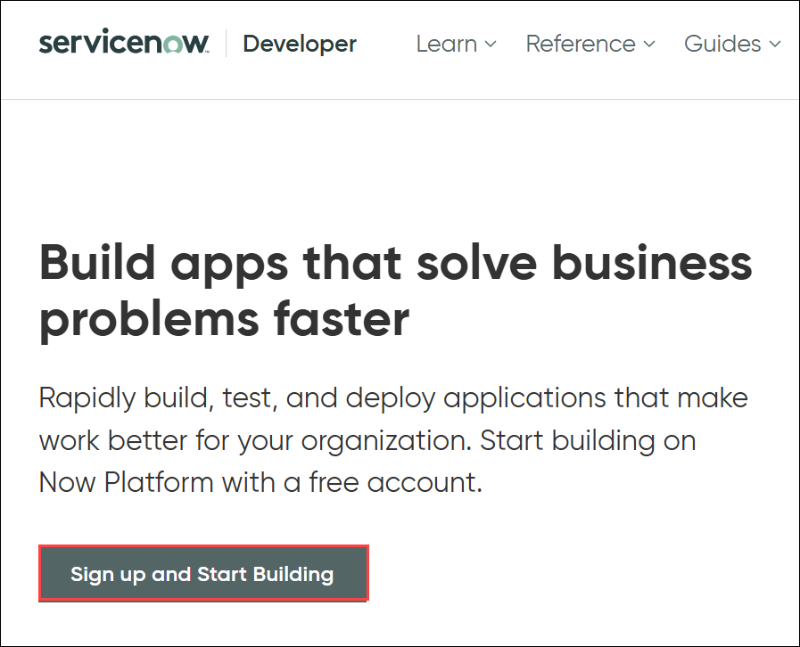

1. Now you will be navigated to **Sign Up** page. Please fill up the details and click on **Sign Up**.

   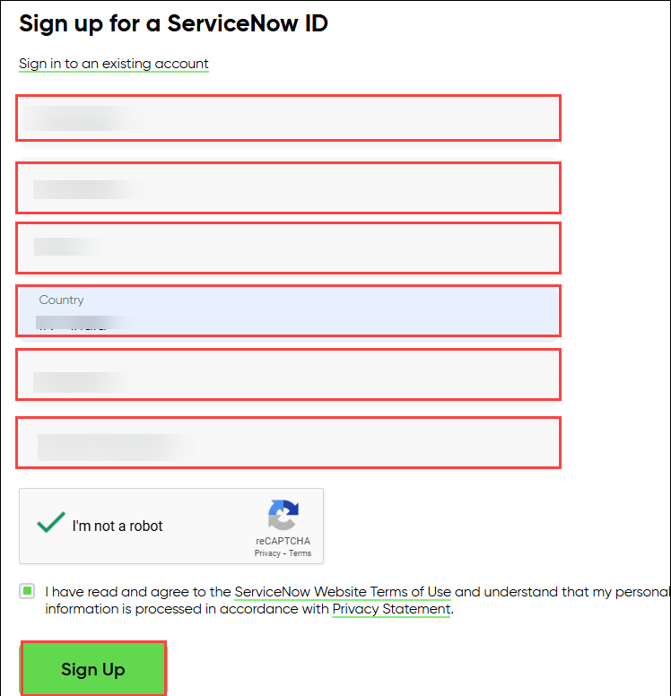

   > **Note:** For the details, you can use your own credentials to sign up for servicenow account.

1. Once after signing up, you will get a verification mail to the account which you have provided.

    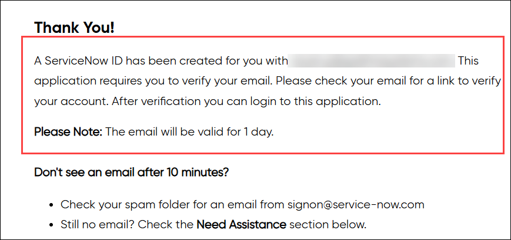

1. Please click on **verify Email**, and login using your credentials.

   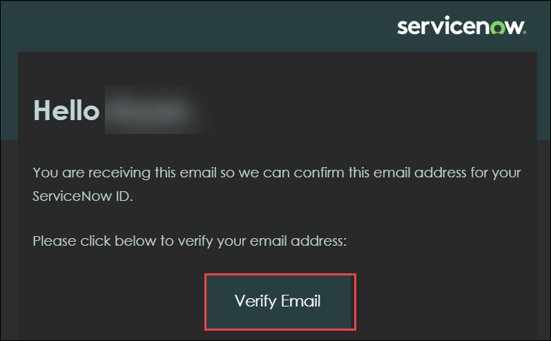

1. Once verified, you will be navigated to ServiceNow developer portal.

1. In the **Do you code ?** pop up, select **No** and click on **Next**. In the next pane, click on **Finish Setup**.

   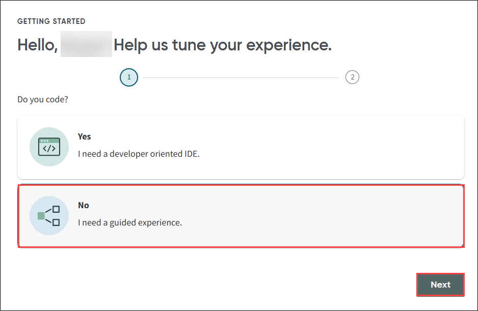

1. From the navigation menu of developer portal, click on **Request Instance**.

   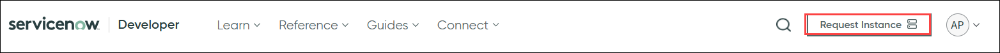

1. On the **Request an Instance** pane, select **Xanadu (1)** release and click on **Request (2)**

   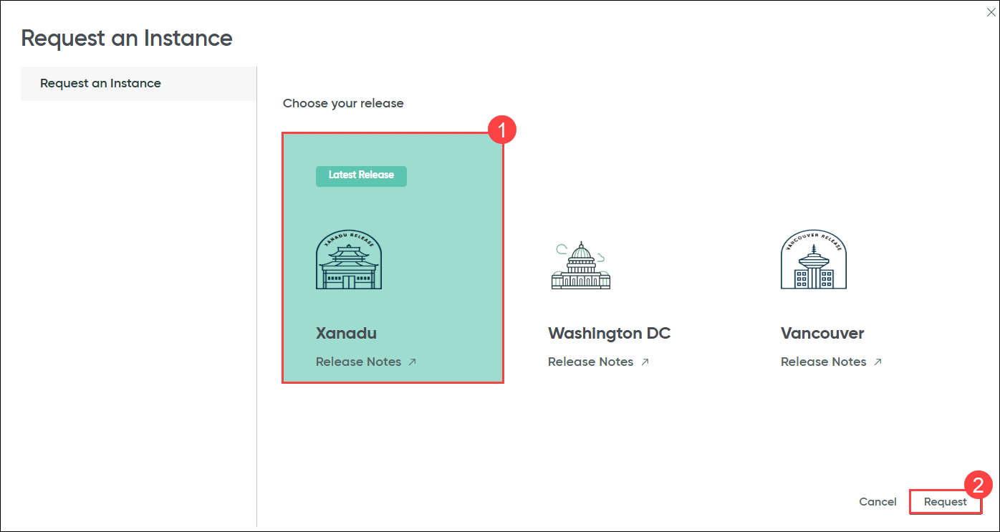

   >**Note:** It will take few minutes to get the instance allocated.

1. Once the instance is allocated, click on your profile.

   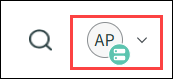

1. Now, you have to assign the user with **admin** role. To do that, click on **<> Change User Role** option.

   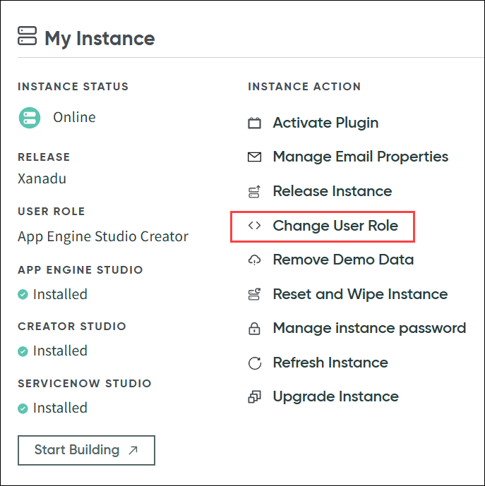

1. In **Change User Role** page, select **Admin** and click on **Change User Role**.

   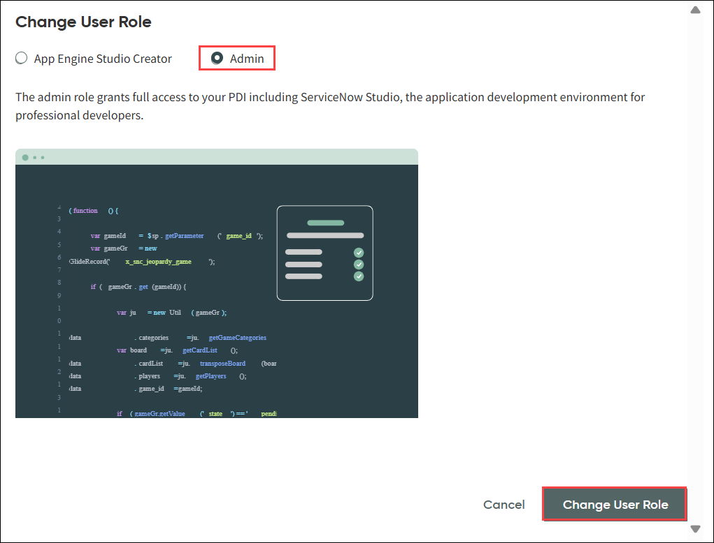

1. Once the role is set to admin, again from the profile menu, select **Manage instance password**.

   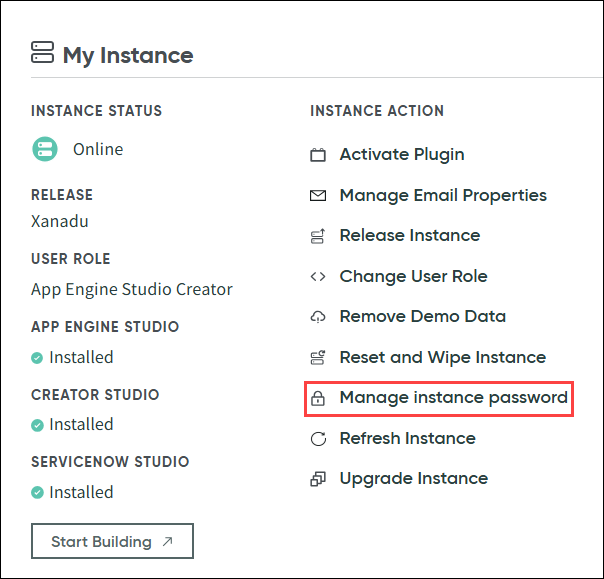

1. In the **Manage Instance password** pane, copy `Instance URL` **(1)**, `Username` **(2)** and `Password` **(3)** values to your notepad. You will be using these values further in this task.

   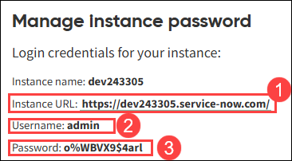

1. Navigate back to the home page of **Developer Portal**.

1. From the home page, click on **Start Building** option.

   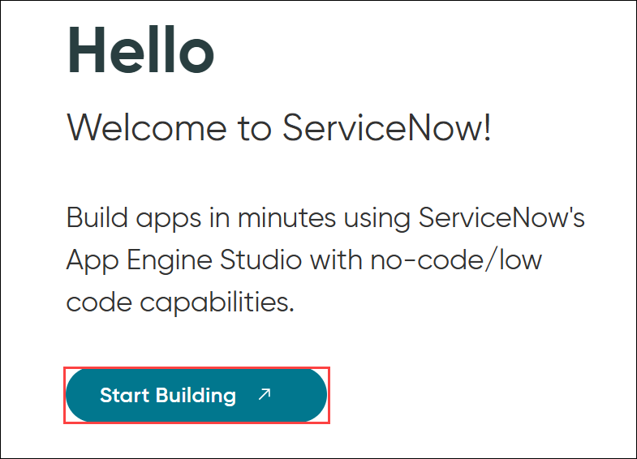

1. Now you will be navigated to creator portal. From the navigation menu, select **All (1)** and click on **Incidents (2)** from the dropdown.

   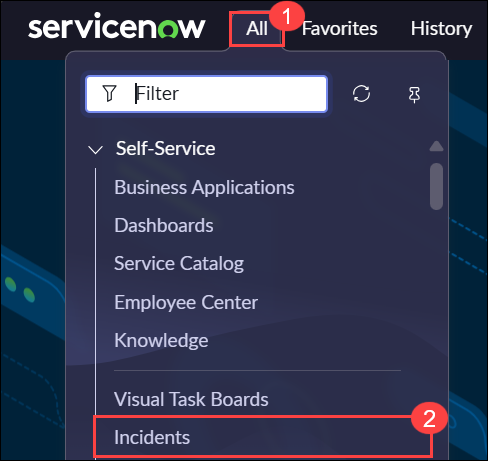

1. Once you are in the **Incidents** pane, click on **View: Self Service** option to remove the filters.

   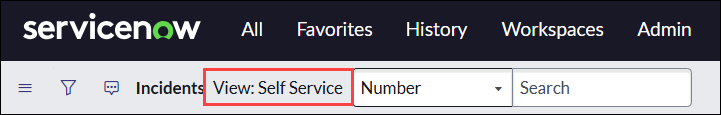

1. Now from the options, select **View** as **Default View** and **Filters** as **--None--**.

   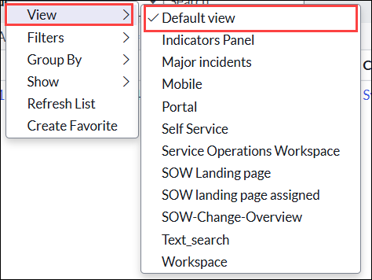

   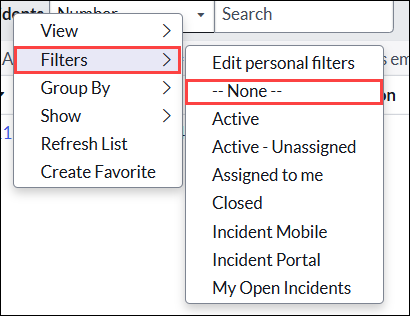

1. Now, you will be able to see all the incidents that are reported. The incidents which are already present are the demo incidents which are present by default.

   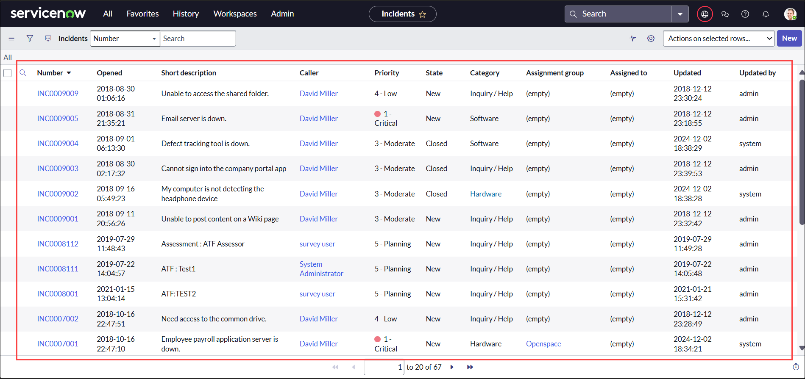

1. Now the ServiceNow is completly setup to get the incidents from Azure Monitor.

1. As the ServiceNow is setup, navigate back to the Azure Portal.

1. In the Azure Portal select the resource group **hands-on-lab-<inject key="DeploymentID"></inject>**.

1. From the resource list, select **logicapp-<inject key="DeploymentID"></inject>** Logic app.

   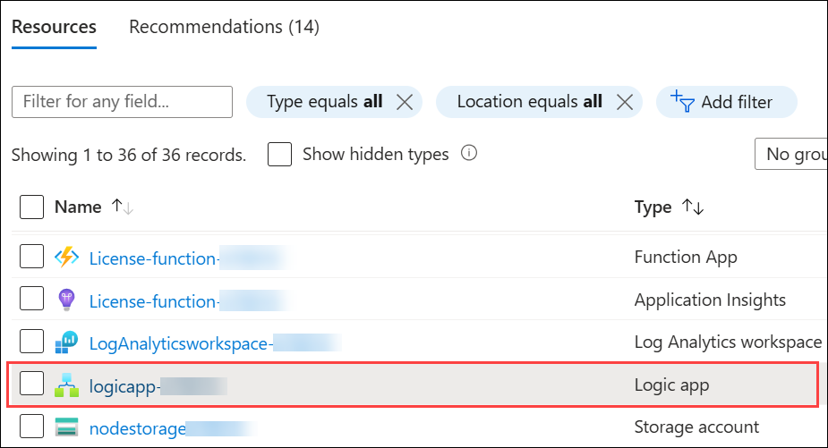

1. In the **Overview (1)** pane of logic app, select **Get Started (2)** tab and click on **Choose Template (3)**.

   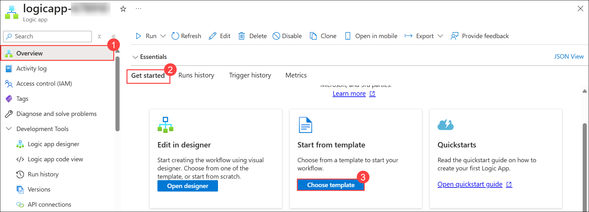

1. From the list of templates, select **Azure Monitor - Metrics Alert Handler** template.

   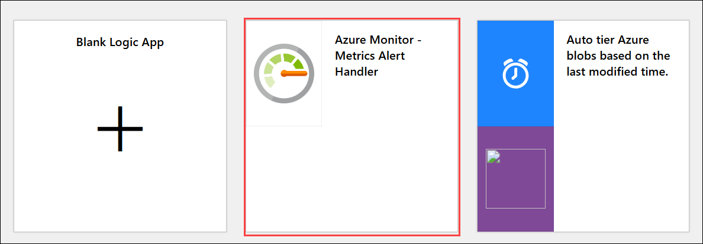

1. In the next pane, select **Use this template**.

   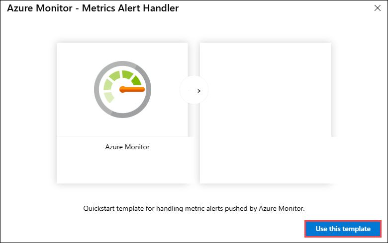

1. Once the template is selected, you can see a **HTTP node** is created in the designer with pre designed schema. This will listen to the alerts from the alert rules.

   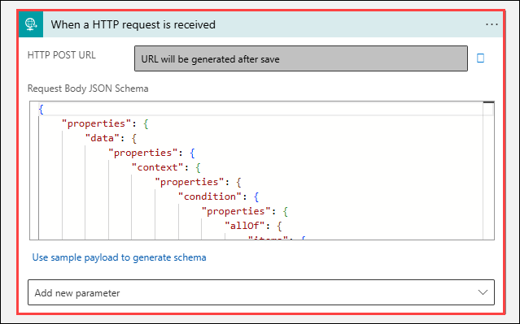

1. Select **+ New Step** in the designer.

   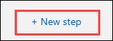

1. From the list of connectors, search and select **ServiceNow** connector.

   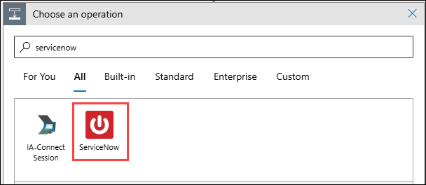

1. In the **Actions** menu select **Create Record** action.

   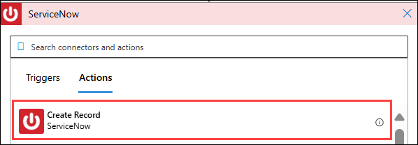

1. In the configuration pane of ServiceNow connector, Provide these details and click on **Create (6)**.

    | Keys | Values |
    | -- | -- |
    | **Connection name** | servicenow **(1)** |
    | **Authentication type** | Select **Basic Authentication (2)** |
    | **Instance** | Provide **Instance URL (3)** that you have copied previously |
    | **Username** | Provide **username (4)** that you have copied previously |
    | **Password** | Provide **Password (5)** that you have copied previously |

   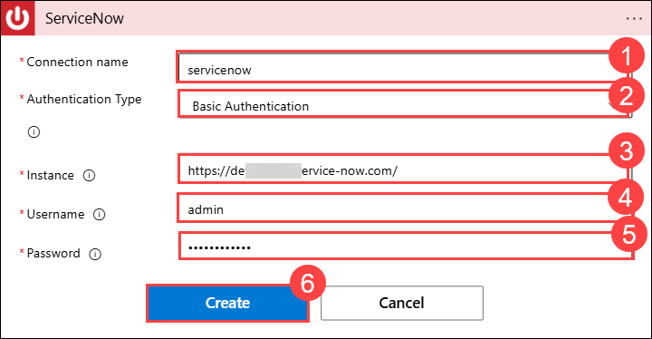

1. Once configured, In the **Create Record** pane, select **Record Type (1)** and click on **Add new parameter (2)**

   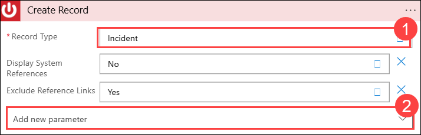

1. From the parameters list, search and select **Short description** parameter.

   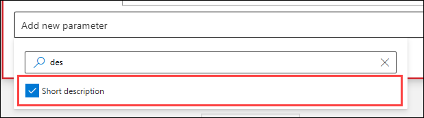

1. Once selected, a menu will be opened for dynamic values. Select **description** from the list.

   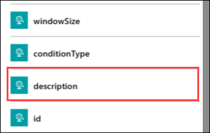

1. Once after configuring, click on **Save** option from the top menu.

   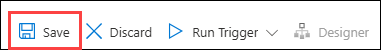

1. As the logic app is configured, now you will setup up a alert rule so that, it will trigger the flow in logic app.

1. Navigate back to your resource group. From the resource list, select **TollBoothFunctions-<inject key="DeploymentID"></inject>**.

   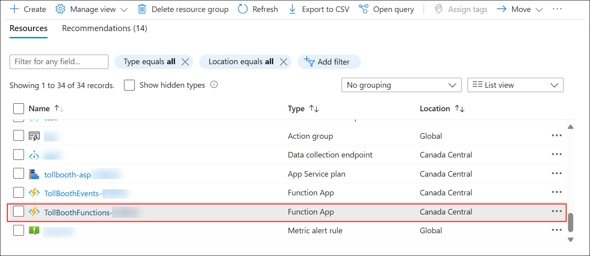

1. In the overview pane of function app, select **ProcessImage** function.

   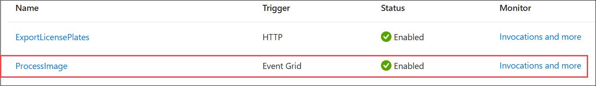

1. Once you are in the **ProcessImage** function pane, select **Metrics (1)** tab and click on **Failed Execution Count (2)** as the alert should be configured for failures in processing images.

   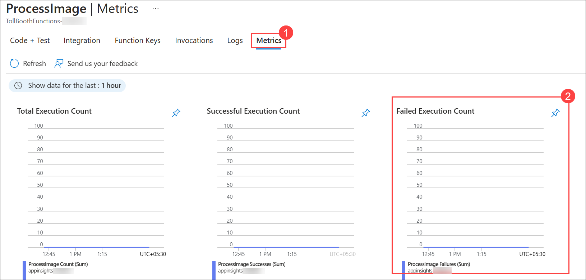

1. In the **Metrics** pane, select **New alert rule**.

   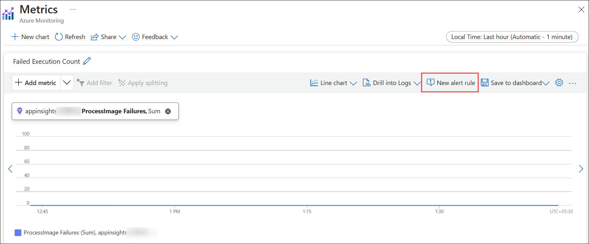

1. On the **Create an alert rule** pane, provide the details as given and click on **Next: Actions > (8)**.

    | Setting | Action |
    | -- | -- |
    | **Signal name** | ProcessImage Failures (1) |
    | **Threshold type** | **Static (2)** |
    | **Aggregation type** | Count (3) |
    | **Value is** | **Greater than (4)** |
    | **Threshold** | **5** (5) |
    | **Check every** | 1 minute (6) |
    | **Lookback period** | 1 minute (7) |

   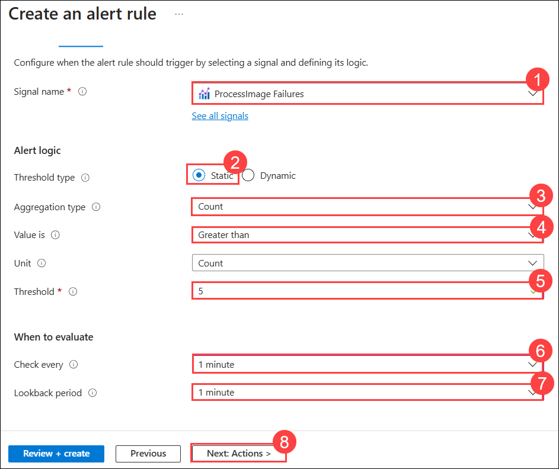

1. In the **Actions** pane, click on **+ Create action group**.

   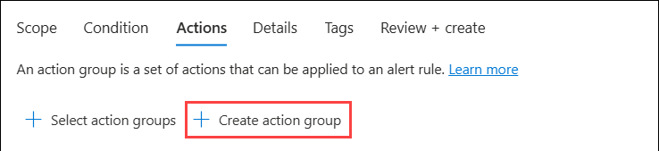

1. In **Create action group** page, provide the following details and click on **Next: Notifications > (4)**.

    | Setting | Action |
    | -- | -- |
    | **Resource group** | **hands-on-lab-<inject key="DeploymentID"></inject> (1)** |
    | **Action group name** | **Action Group ITSM (2)** |
    | **Display name** | **ITSM (3)** |

   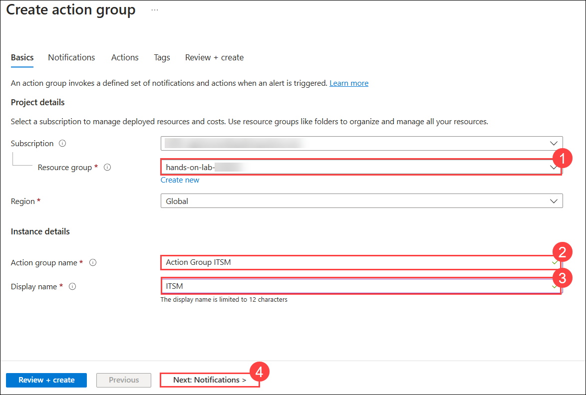

1. As you will be integrating this with logic app, skip the notification configurations and click on **Next: Actions >**.

1. In the Actions pane, select **Action type** as **Logic App (1)** and provide **Name** as **ITSM Records (2)**. Click on **edit (3)** to configure the logic app.

   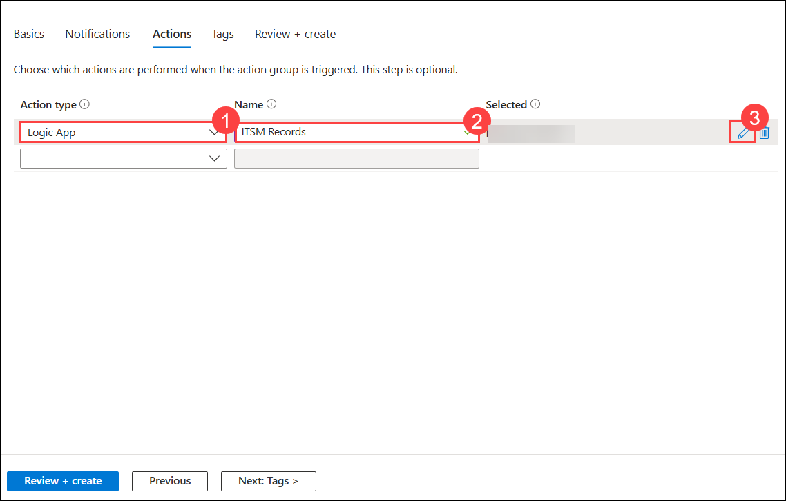

1. In the Logic App page, select **hands-on-lab-<inject key="DeploymentID"></inject> (1)**, Select **logicapp-<inject key="DeploymentID"></inject> (2)** logic app and click on **Ok (3)**.
 
   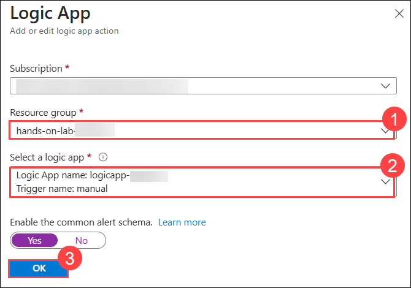

1. Once configured, click on **Review + Create** and click on create to create the action group.

   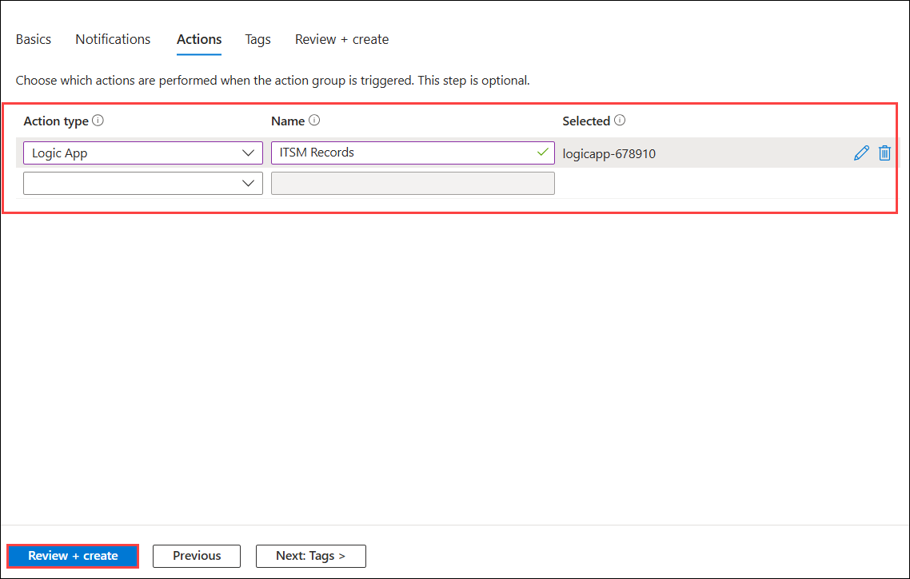

1. Once the action group is created, select **Next: Details >** to move to Details page.

   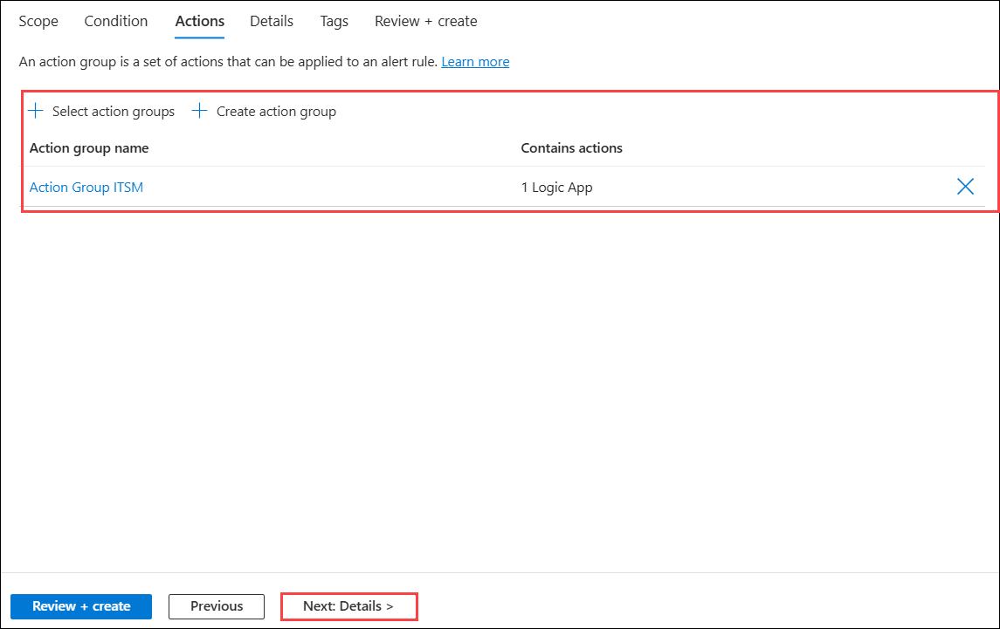

1. On the details pane, provide details as follows and click on **Review + Create (5)**. Click on create to create the alert rule.

    | Setting | Action |
    | -- | -- |
    | **Resource group** | **hands-on-lab-<inject key="DeploymentID"></inject> (1)** |
    | **Severity** | **1- Error (2)** |
    | **Alert rule name** | `Failed` **(3)** |
    | **Alert rule description** | `The image processing is failed` **(4)** |

   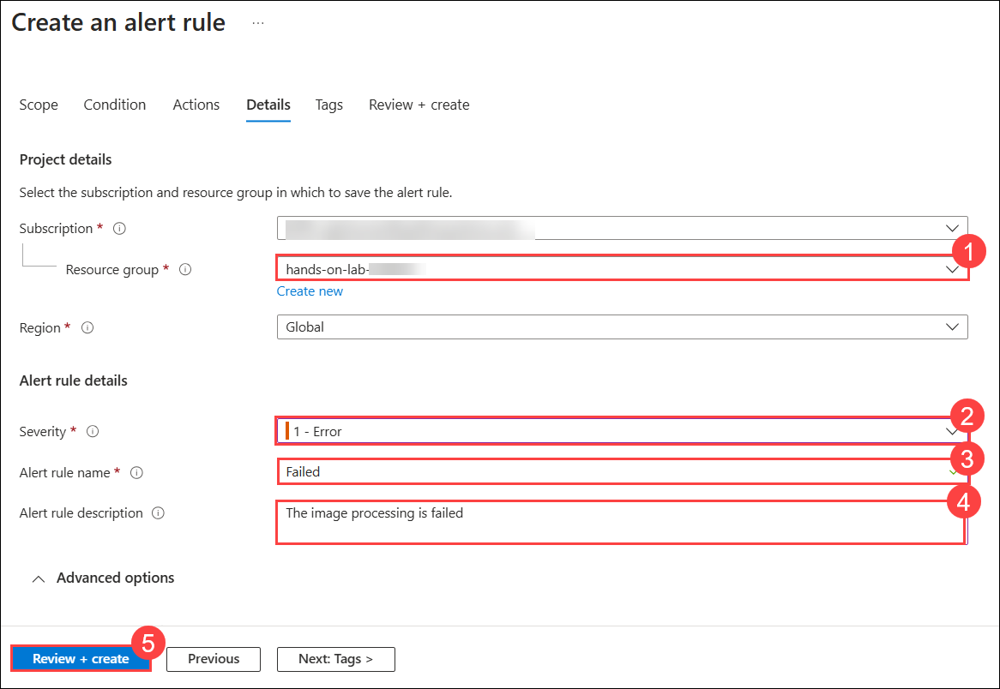

1. Now it's time to test the flow, navigate to **Visual Studio**.

1. Inside **Visual Studio**, Navigate to the **UploadImages** project using the Solution Explorer. Right-click on **UploadImages (1)** project, select **Debug (2)** and click on **Start New instance (3)**.

   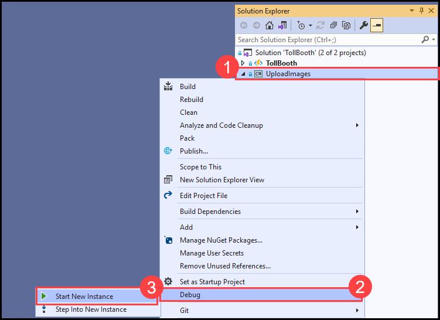

1. When the console window appears, enter **2** and press **ENTER**. This action uploads a handful of car photos to the images container of your Blob storage account. 

   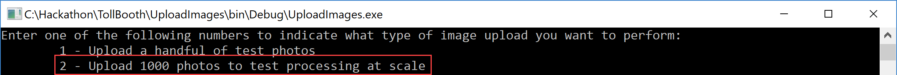

1. Once the image upload process is done, navigate back to **ServiceNow** Incidents page.

1. In the **incidents** page, wait for few minutes and refresh the page. You should be able to see the new record is created in the portal with the Short description *The image processing is failed*.

   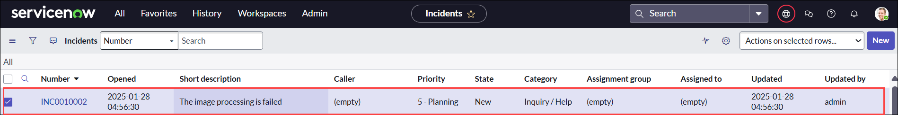

   >**Note:** You have successfully built a flow where the Azure alerts are successfully connected with ServiceNow.
   
### Task 5: Configure alert escalation policies and multiple notification channels  

Set up alert escalation policies and configure multiple notification channels to ensure timely responses. 

### Task 6: Cq

Learn to create multi-condition alerts that trigger based on a combination of performance metrics and log data. 

1. In the search bar of the Azure Portal, type **Application Insights (1)** and select **Application Insights (2)** from the search results.
1. Select the appinsights-<inject key="DeploymentID" enableCopy="false" />.
1. Select **Alerts** under **Monitoring**.
1. Click on **+ Create** and then **+ Alert rule**.
1. Select the following options and click on **Next:Actions**.
    | Setting | Action |
    | -- | -- |
    | **Signal name** | Failed requests |
    | **Threshold type** | **Dynamic** |
    | **Aggregation type** | Total |
    | **Value is** | **Greater than** |
    | **Threshold Sensitivity** | Medium |
    | **Check every** | 1 minute |
    | **Lookback period** | 5 minute |

1. Click on **Use action groups**.
1. Click on **Server-Exceptions-for-TollBoothFunctions-<inject key="DeploymentID"></inject>**, followed by **Select**.
1. Click on **Next:Details**.
1. Enter **Server Exceptions Alert** for **Alert rule name**.
1. CLick on Advanced options and **uncheck** the box for **Automatically resolve alerts**.
1. CLick on **Review + create**, followed by **Create**.