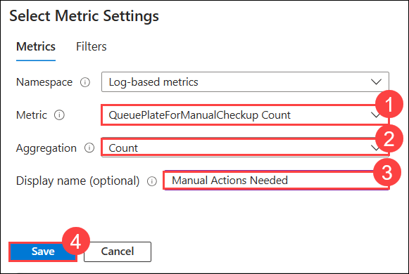

# Exercise 5: Visualizing Monitoring Data (45 Minutes)(Log Analytic Workspace) 

### Task 1: Create a custom Azure Monitor Dashboard for serverless architecture performance 

Build a custom Azure Monitor dashboard to visualize and track the performance of your serverless architecture. 

### Task 2: Build a custom workbook to visualize interactive reports, with parameters and filters 

In this task, you will create interactive reports in Azure Monitor by utilizing workbooks with parameters. This approach allows you to collect input from users and reference it in various parts of the workbook, enabling dynamic data scoping and visualization adjustments.

1. In the Azure Portal, search for **Workbooks** and select **Azure Workbooks**.

   

1. Once you are in the Azure Workbooks page, click on **+ Create** to create a new workbook.

   

1. In the **Monitor | Workbooks | Gallery** pane, select **Empty** under Quick Start tab.

   

1. In the creation space, click on **+ Add (1)** and select **</> Add parameters (2)**.

   

   > **LabTip: Parameters** are configurable input controls that allow users to dynamically interact with and customize reports. They can be presented as text boxes, dropdown lists, or other input types, and are used to collect user input that can be referenced throughout the workbook. This functionality enables the creation of interactive and tailored visualizations, as users can adjust parameters to filter data, modify queries, and alter visual elements in real-time. 

1. In the next pane, select **Add Parameter**.

   

1. In the New parameter page, provide the following details and click on **Save (7)**.

    | Setting | Action |
    | -- | -- |
    | **Parameter name** | `Status` **(1)** |
    | **Display name** | `Type` **(2)**  |
    | **Parameter type** | Select **Drop down (3)** |
    | **Required?** | **Check** the box **(4)** |
    | **Get data from** | Set to **JSON (5)** |
    | **Json Input** | Set as provided below **(6)** |

    ```
    [
     { "value": "Processed", "label": "Processed" },
     { "value": "Failed", "label": "Failed" }
    ]
    ```

   

1. Now click on **&#x2714; Done Editing** to save the parameter.

   

1. Once saved, you will be able to set the parameter as **Processed or Failed** to get the data dynamically.

   

1. Now you have to add the query to get data accordingly as per the parameter. To do that, click on **+ Add (1)** again and select **Add query (2)**

   

1. In the query box, configure the settings as per the details provided below and click on **Run Query (6)**. Select these options using the drop down.

    | Setting | Action |
    | -- | -- |
    | **Data Source** | **Logs (Analytics) (1)** |
    | **Resource Type** | **Log Analytics (2)**  |
    | **Log Analytics Workspace** | Select **LogAnalyticsworspace-<inject key="DeploymentID" enableCopy="false" />** **(3)** |
    | **Visualization** | **Area chart (4)** |
    | **Query** |  Paste the following query **(5)** |
    
     ```
     FunctionAppLogs
     | where Level == iff('{Status}' == 'Processed', 'Information', 'Warning') or Level == iff('{Status}' == 'Processed', 'Information', 'Error')
     | summarize ProcessedCount = count() by bin(TimeGenerated, 1d)
     | order by TimeGenerated desc
     ```
   

   >**LabTip:** This KQL query filters logs from the FunctionAppLogs table based on the Level field, selecting entries where the level corresponds to the specified Status parameter. It then aggregates the count of these entries into daily bins and sorts the results in descending order of time. This approach allows for dynamic filtering of logs based on the processing status, providing insights into the application's performance over time.

1. Once you run the query, you will be able to see the data according to the parameters selected. Now, click on **&#x2714; Done Editing** to save the query.

   

1. You have successfully used paramters with filters and created a interactive workbook.

   

### Task 3: Explore visualization of Application Insights data in Log Analytics workbooks 

In this task, you will integrate data from Application Insights into workbooks to create comprehensive monitoring solutions.

1. In the same workbook, which you were using in previous task, let's include **Application Insights** metric to get the count of images which need manual intervention.

1. Click on **+ Add (1)** and select **Add metric (2)** to add a new metric to the workbook.

   

1. In the metric configuration pane, configure the settings as provided and click on **Add metric (4)**.

    | Setting | Action |
    | -- | -- |
    | **Resource type** | **Application Insights (1)** |
    | **Application Insights** | **appinsights-<inject key="DeploymentID"></inject> (2)**  |
    | **Time Range** | **Last 24 hours (3)** |

   

1. In the **Select Metric Settings** pane, provide the following details and click on **Save (4)**

    | Setting | Action |
    | -- | -- |
    | **Metric** | **QueuePlateForManualCheckup Count (1)** |
    | **Aggregation** | **Count (2)**  |
    | **Display name (Optional)** | `Manual Actions Needed` **(3)** |

   

1. Once saved, you will beable to see a line chart as selected. This shows that how many images need to be processed manually. Click on **&#x2714; Done Editing**

   

   >**Note:** The colour and the graph may look diffrently for you, please ignore these and continue further.

1. Now your workbook will look something similar to this. Click on **&#x1F4BE; (2)** to save the workbook.

   

1. In the **Save As** pane, provide **Title** as **interactive (1)** and select **Resource group** as **hands-on-lab-<inject key="DeploymentID"></inject> (2)**. Once done, click on **Save As (3)**.

   

   >**Note:** You can add multiple metrics from multiple resources to your workbook and customize it in more advanced way.

### Task 4: Add live metrics streaming to the dashboard to monitor real-time function execution and health 

Enhance your dashboard with live metrics streaming to monitor real-time function execution and overall health. 

In this task you will be using Live Metrics feature of App Insights to monitor the performance of your function app. You will run the Complete Application which will process and store 1000 images which you will track in real-time.

1. Open the **appinsights** Application Insights resource from within your lab resource group.

   

1. In Application Insights, select **Live Metrics Stream** under **Investigate** in the left-hand navigation menu.

   
1. Leave the Live Metrics Stream open and return to the starter app solution in Visual Studio on the LabVM.

1. Right-click the **UploadImages** project in the Solution Explorer, select **Debug**, then **Start New Instance** from the context menu.

   

   >**Note:** Ensure the files are located under `C:\ServerlessMCW\`. If the files are located under a longer root path, such as `C:\Users\workshop\Downloads\`, then you will encounter build issues in later steps: `The specified path, file name, or both are too long. The fully qualified file name must be less than 260 characters, and the directory name must be less than 248 characters.`

1. When the console window appears, enter **1** and press **ENTER**. This action uploads a handful of car photos to the images container of your Blob storage account.

   

1. Switch back to your browser window with the Live Metrics Stream still open within Application Insights. You should start seeing new telemetry arrive, showing the number of servers online, the incoming request rate, CPU process amount, etc. You can select some of the sample telemetry in the list to the side to view output data.

   
   
   >**Note**: The number of servers online here may differ for you, you can ignore that.

1. Leave the Live Metrics Stream window open once again and close the console window for the image upload. Debug the UploadImages project again, then enter **2** and press **ENTER**. This will upload 1,000 new photos.

   

1. Switch back to the Live Metrics Stream window and observe the activity as the photos are uploaded. You can see the number of servers online, which translates to the number of Function App instances running between both Function Apps. You should also notice things such as a steady cadence for the Request Rate monitor, the Request Duration hovering below \~200ms second, and the Incoming Requests roughly matching the Outgoing Requests.

   

   >**Note**: The number of servers online here may differ for you, you can ignore that.

1. After this has run for a while, close the image upload console window once again, but leave the Live Metrics Stream window open.

## Task 5: Observe your functions dynamically scaling when resource-constrained

In this task, you will change the Computer Vision API to the Free tier. This will limit the number of requests to the OCR service to 10 per minute. Once changed, run the UploadImages console app to upload 1,000 images again. The resiliency policy is programmed into the FindLicensePlateText.MakeOCRRequest method of the ProcessImage function will begin exponentially backing off requests to the Computer Vision API, allowing it to recover and lift the rate limit. This intentional delay will significantly increase the function's response time, causing the Consumption plan's dynamic scaling to kick in, allocating several more servers. You will watch all of this happen in real-time using the Live Metrics Stream view.

1. Open your Computer Vision API service by opening the **hands-on-lab-SUFFIX** resource group and then selecting the resource that starts with **computervision-**.

   

1. Select **Pricing tier**(1) under **Resource Management** in the menu. Select the **F0 Free**(2) pricing tier, then select **Apply**(3).

   > **Note**: If you already have an **F0** free pricing tier instance, you will not be able to create another one.

   

1. Switch to Visual Studio, debug the **UploadImages** project again, then enter **2** and press **ENTER**. This will upload 1,000 new photos.

   

1. Switch back to the Live Metrics Stream window and observe the activity as the photos are uploaded. After running for a couple of minutes, you should start to notice a few things. The Request Duration will begin to increase over time. As this happens, you should notice more servers being brought online..

   

   >**Note**: The number of servers online here may differ for you, you can ignore that.

1. After this has run for some time, close the UploadImages console to stop uploading photos.

1. Navigate back to the **Computer Vision** resource in the Azure portal and set the pricing tier back to **S1 Standard**.

